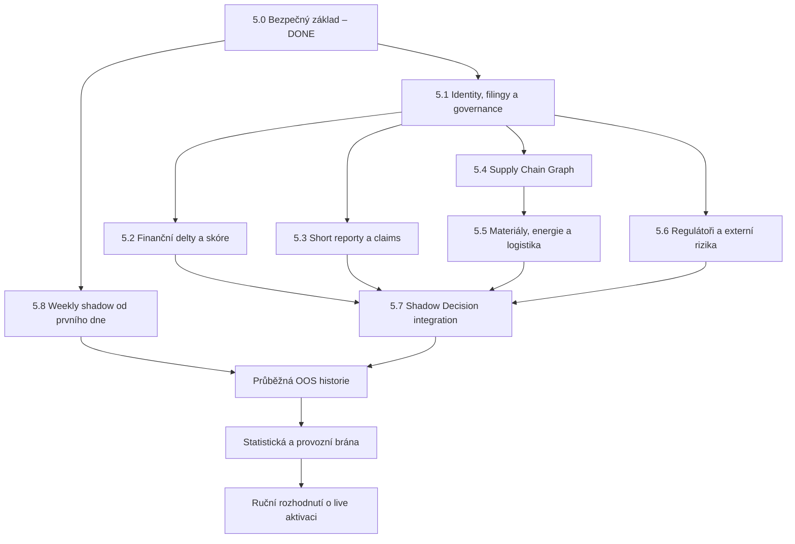

# Company Intelligence / Forensic – implementační backlog

Tento soubor je jediný průběžně aktualizovaný seznam úkolů pro rozšíření
JOHNY-SKORE o firemní, fundamentální a forenzní analýzu. Rozlišuje mezi již
funkčním bezpečným MVP a plným rozsahem původního návrhu.

Auditní základ: `main` po sloučení PR #79; live pilot zůstává omezen na 36 tickerů
a běží pouze jako shadow. Rozšíření live smoke a risk overlayů je průběžně
ověřováno deterministickým CI a pondělním production-shadow během srpna 2026.

Implementační aktualizace bodů 1–4 byla sloučena přes PR #77 a je
chronologicky zapsaná v `COMPANY_INTELLIGENCE_CHANGELOG.md`. Kódové opravy
identity runtime, evropského runtime/feedu, globálního source resolveru a
regulační cesty do DecisionAgentu jsou dokončené. Americký identity pilot a
obnova weekly artefaktu jsou nyní doložené; evropské regionální canary, ochrana
`main` a statistický OOS důkaz zůstávají otevřené.

## Audit 2026-08-25 – kanonický tickerový zdroj

Pro NEW ANALYZER je nyní závazným zdrojem universe export
`market_checker_20260818_213623.xlsx`:

| Kontrola | Stav | Důkaz |
| --- | --- | --- |
| Počet tickerů | PASS | 687 řádků v listu `Signals` |
| Unikátnost | PASS | 687 unikátních tickerů, 0 duplicit |
| Yahoo mapování | PASS | `yahoo_ticker` je vyplněn u všech 687 řádků |
| Reprodukovatelný zdroj v repu | DONE | `market_checker_app/data/market_checker_687_tickers.csv` |
| Validace zdroje | DONE | `market_checker_app/utils/ticker_universe.py` |
| UI fallback | DONE | bez vlastního Excelu/ručního watchlistu použije 687 tickerů |
| Weekly shadow fallback | DONE | bez explicitního `--tickers` použije 687 tickerů |
| Skutečný 687tickerový produkční běh | BLOCKED | workflow už cílí na 687; Ubuntu běh s `--no-mt5` nemá plná technická data pro universe >100 a musí se nejdřív odblokovat |
| Predikční přínos | BLOCKED | stále chybí OOS historie, 200 vzorků a 12 týdnů |

Tento audit pouze sjednocuje vstupní universe. Nemění scoring, BUY/SELL logiku
ani bezpečnostní pravidlo, že rozšířené vrstvy zůstávají v shadow režimu.

## Význam stavů

- `DONE` – celý rozsah úkolu je implementovaný, persistovaný a pokrytý
  deterministickým testem; případný živý provozní důkaz je výslovně sledovaný
  v Etapě 5.8.
- `PARTIAL` – použitelný základ existuje, ale nesplňuje celý původní rozsah.
- `TODO` – zatím chybí.
- `BLOCKED` – kód může být připravený, ale chybí externí předpoklad nebo reálná
  časová data.

Změna na `DONE` je povolena pouze tehdy, když jsou splněna všechna uvedená
akceptační kritéria. Samotná existence třídy nebo tabulky nestačí.

## Výsledek aktualizovaného auditu v PR #79

Celkový verdikt: bezpečný shadow základ včetně skutečného amerického live
pilotu, produkčního 687tickerového watchlistu a obnovy SQLite mezi běhy je
funkční. Kompletní Company Intelligence vrstva ještě hotová není a zvýšení
přesnosti nebylo prokázáno, protože zatím neexistují uzavřené OOS výsledky z
12 nezávislých týdnů.

| Kontrola | Výsledek | Důkaz / dopad |
| --- | --- | --- |
| `main` po PR #77 | PASS | merge commit `5c04845`; PR #77 je merged |
| Deterministické CI | PASS | [run 32491059397](https://github.com/littleleg198602/JOHNY-SKORE/actions/runs/32491059397) skončil `success` pro kód live pilotu v PR #79 |
| Produkční universe | PASS | `production_watchlist.txt` obsahuje 687 unikátních tickerů v pořadí předaného exportu; množina souhlasí s předanou SQLite historií |
| Běžný autonomous runtime | PASS / SAFE-OFF | UI i weekly runner umějí identity a evropské manifesty/feed; workflow používá zdrojovaný watchlist a zůstává vždy shadow |
| Primární identity | PASS PILOT | 10/10 přesných SEC identit prošlo živě bez fuzzy/name discovery a bez konfliktu; dalších 26 tickerů 36tickerového pilotu zůstává jen SEC-discovered a nepatří do identity-dependent komponent |
| Evropské filingy | PARTIAL | direct URL i bezpečný RSS/Atom discovery runtime fungují; chybí regionální live canary a konkrétní produkční feedy pro všechny autority |
| Hierarchie zdrojů | PASS | globální canonical resolver, preference, historie změn a QualityGate kontrola se persistují napříč agenty |
| Governance události | PASS | schema, observations, point-in-time a nulový obchodní signál |
| Regulatory → Decision cesta | PASS | explicitní primární typ zdroje + právní identita projdou do konzervativního `NO_TRADE`; legacy/RSS zdroj zůstává media-only |
| Weekly production shadow | PASS | runy [32490389851](https://github.com/littleleg198602/JOHNY-SKORE/actions/runs/32490389851) a [32491052650](https://github.com/littleleg198602/JOHNY-SKORE/actions/runs/32491052650) prošly; druhý obnovil první SQLite artefakt a přidal novou observation historii |
| Ochrana `main` | FAIL | větev není protected a nemá povinný status check |
| Zvýšení přesnosti | BLOCKED | nejsou 200 uzavřených OOS vzorků ani 12 nezávislých týdnů |

Rychlý stav tasků po auditu:

- `DONE` (15/36): bezpečný základ `CI-001` až `CI-010`, `ENTITY-101`,
  `FILING-101`, `FILING-103`, `GOV-101`, `OPS-801`.
- `PARTIAL` (9/36): `FILING-102`, `FORENSIC-201`,
  `SHORT-301`, `SHORT-302`, `SHORT-303`, `SUPPLY-401`, `REG-602`,
  `DECISION-701`, `DECISION-702`.
- `TODO` (11/36): `FORENSIC-202`, `SHORT-304`, `SHORT-305`, `SUPPLY-402`,
  `SUPPLY-403`, `RESOURCE-501`, `RESOURCE-502`, `RESOURCE-503`, `REG-601`,
  `OPS-802`, `OPS-803`.
- `BLOCKED` (1/36): `EVAL-703` čeká na skutečnou OOS historii a navíc potřebuje
  component-level ablation.

Bezprostřední pořadí po opravách bodů 1–4:

1. [x] dokončit runtime manifest identit a fail-closed kontrolu,
2. [x] zapojit evropské zdroje do UI/weekly runneru a bezpečný feed discovery,
3. [x] persistovat globální řešení konfliktů dokumentů napříč agenty,
4. [x] opravit prioritu a právní identitu `RegulatoryContractAgent`,
5. [x] naplnit produkční watchlist, ověřit 10 přesných identit a dvakrát spustit
   skutečný weekly production-shadow včetně obnovy historie,
6. [ ] teprve potom pokračovat plnými forenzními skóre a dalšími analytickými
   větvemi; vše stále pouze v shadow režimu.

Samostatně zůstává otevřené nastavení ochrany `main` a evropské regionální
canary; tyto body nesmějí být zaměněny za již dokončený americký pilot.

## Komplexní cíl

Cílem je vytvořit auditovatelnou Company Intelligence vrstvu, která pro každý
ticker vysvětlí nejen pohyb ceny, ale i skutečný stav firmy a rizika v jejím
okolí. Vrstva má z primárních dokumentů a ověřených událostí určit, zda je
původní týdenní predikce v2.1 dostatečně důvěryhodná pro obchod, nebo zda má být
bezpečně potlačena na `NO_TRADE`.

Konečný systém musí pro každý podporovaný ticker umět:

1. jednoznačně určit emitenta, právní entity a obchodované instrumenty,
2. získat regulatorní dokumenty dostupné v okamžiku rozhodnutí,
3. vypočítat finanční delty, forenzní a governance rizika,
4. evidovat short reporty a ověřovat jejich jednotlivá tvrzení,
5. vytvořit zdrojovaný graf zákazníků, dodavatelů, závodů a kontraktů,
6. spojit graf s materiály, energií, logistikou, cenami a hedgingem,
7. sledovat regulátory, sankce, ratingy a další závažné externí události,
8. převést pouze dostatečně kvalitní evidence do shadow risk-overlay,
9. průběžně měřit skutečný OOS přínos proti stejné predikci v2.1,
10. případné ostré použití povolit pouze ručně po splnění všech statistických a
    provozních bran.

### Měřitelný cílový stav

- Systém zvládne celý 687tickerový universe; nové zdroje se nejdříve ověřují na
  pilotní sadě 10–36 společností.
- Každý použitý fakt, vztah, claim a risk komponenta má zdroj, čas, confidence a
  stabilní auditní ID.
- Žádná evidence získaná po okamžiku predikce nesmí ovlivnit její OOS hodnocení.
- Short report sám nikdy nevytvoří `SELL`.
- První produkční politika smí pouze ponechat původní akci nebo ji potlačit na
  `NO_TRADE`.
- Candidate dosáhne nejméně 200 uzavřených OOS vzorků a 12 nezávislých týdnů.
- Lift je alespoň 2 procentní body a jeho dolní 95% mez je nad nulou.
- Přínos je kladný alespoň v 60 % týdnů a coverage neklesne pod 35 %.
- Nezhorší se false-positive rate, Brier score ani kalibrace.
- Brána projde třikrát nad postupně rozšířeným časovým oknem.
- Teprve potom může vzniknout ručně schválený návrh na ostré zapnutí.

Úspěch tedy není „máme více agentů“, ale prokazatelné a opakovatelné snížení
chybných obchodů bez použití budoucích informací.

## Přesná návaznost etap



Etapy 5.2, 5.3, 5.4 a 5.6 mohou po dokončení 5.1 běžet paralelně. Etapa 5.5
musí navázat na firemní graf 5.4. Etapa 5.7 nesmí začít používat novou datovou
rodinu, dokud její předchozí etapa nemá provenance, point-in-time testy a
QualityGate kontroly. Etapa 5.8 běží souběžně od začátku, protože 12 reálných
týdnů nelze bezpečně nahradit zpětným backfillem.

## Cíl a výstup jednotlivých etap

| Etapa | Vstup | Hlavní cíl | Povinný výstup | Výstupní brána | Navazuje na |
| --- | --- | --- | --- | --- | --- |
| 5.0 Bezpečný základ | Predikce v2.1 | Jednotný audit a fail-closed provoz | Orchestrace, SQLite, QualityGate, shadow Decision/Evaluation | Testy, persistence a nulový zásah do live predikce | Hotovo |
| 5.1 Identity, filingy, governance | Tickery a veřejné registry | Vědět přesně, kterou firmu a dokument sledujeme | Entity graph identity, SEC rozšíření, Evropa, source priority, governance events | Každý dokument patří správné entitě a má point-in-time provenance | 5.0 |
| 5.2 Finanční delty a skóre | Normalizované filingy | Rozpoznat změny kvality hospodaření, ne pouze poslední číslo | FilingDeltaAnalyzer a čtyři samostatná skóre | Srovnatelná období, coverage, sektorová kalibrace a žádný look-ahead | 5.1 |
| 5.3 Short reporty a claims | Entity registry, filingy, reporty | Oddělit tvrzení, důkazy, reakce a pravdivost | Úplný publisher registry, claim lifecycle, reakce firmy a 1/5/20/60 event study | Report sám nevytvoří SELL; každý stav má nezávislý důkaz | 5.1; pro finanční claims také 5.2 |
| 5.4 Supply Chain Graph | Entity registry a primární dokumenty | Zmapovat skutečné provozní závislosti firmy | Časově verzovaný graf entit, závodů, produktů, dodavatelů, zákazníků a kontraktů | Žádná domyšlená hrana; každá vazba má zdroj a confidence | 5.1 |
| 5.5 Materiály, energie, logistika | Supply graph, filingy a cenové řady | Odhadnout nákladovou citlivost firmy | Sektorové koše, EIA/price adapters, hedging a pass-through model | Bez úplných vstupů interval nebo INSUFFICIENT_DATA, nikdy falešná přesnost | 5.2 a 5.4 |
| 5.6 Regulátoři a externí rizika | Entity registry a specializované registry | Zachytit právní, ratingové, kontraktní a provozní události | USAspending/TED/OFAC, ratingy, FDA/EMA, recalls a governance návaznosti | Primární úřad má prioritu, mediální duplicity jsou sloučené | 5.1 |
| 5.7 Shadow Decision integration | Výstupy 5.2–5.6 | Převést kvalitní evidence na konzervativní risk-overlay | Verzované risk komponenty, konflikty, ablation a návrh KEEP/NO_TRADE | Žádná nová vrstva nevytvoří směr; forged/live pokus QualityGate odmítne | 5.2, 5.3, 5.5 a 5.6 |
| 5.8 Provoz a OOS validace | Týdenní běhy a Stage 5.7 policy | Prokázat, zda komplexní vrstva skutečně zvyšuje přesnost | Trvalá DB, source-health audit, 12+ týdnů, paired OOS a readiness report | 200 vzorků, 12 týdnů, CI > 0, tři průchody a ruční autorizace | Běží od 5.0; finálně hodnotí 5.7 |

## Brány mezi etapami

### Brána A: 5.0 → 5.1

- [x] SQLite migrace je aditivní a atomická.
- [x] Agentní chyba nemění původní predikci.
- [x] QualityGate odmítá chybějící provenance a budoucí data.

### Brána B: 5.1 → analytické větve 5.2/5.3/5.4/5.6

- [ ] ISIN/LEI/CIK/ticker jsou propojené bez nejednoznačnosti pro skutečný
  runtime watchlist, ne pouze pro fixture manifest.
- [x] Zdrojová hierarchie je uložená a testovaná.
- [x] US a evropské filingy používají stejný dokumentový kontrakt.
- [x] Governance události mají vlastní schema a observation historii.
- [x] UI a weekly runner umí načíst identity i evropské filingové manifesty.
- [ ] Příslušné živé identity a regionální canary mají PASS. Americký pilot
  10/10 identit je `PASS`; evropské regionální canary ještě chybějí.

Brána B je po auditu otevřená pouze na úrovni datových kontraktů. Provozní
průchod není splněn, takže nové větve lze dále vyvíjet a testovat, ale nesmějí
se považovat za kompletní ani vstoupit do live rozhodování.

### Brána C: 5.4 → 5.5

- [ ] Materiál je propojen s konkrétní firmou, produktem nebo závodem.
- [ ] Vazba má zdroj a confidence; sektorový koš sám nestačí.
- [ ] Jednotky a měny cenových řad jsou normalizované.

### Brána D: datová větev → 5.7

- [ ] Agent má deterministické fixtures a integrační persistence test.
- [ ] Point-in-time a future-data negativní test prochází.
- [ ] Chybějící data končí jako `INSUFFICIENT_DATA`.
- [ ] Risk komponenta je samostatně vypínatelná a auditovatelná.
- [ ] QualityGate odmítne chybějící dokument, nesprávnou identitu a forged score.

### Brána E: 5.7 → návrh live aktivace

- [x] Reálný weekly workflow obnovuje historii bez resetu.
- [ ] Všechny produkční zdroje mají čerstvý PASS canary.
- [ ] Je splněná kompletní OOS brána z měřitelného cílového stavu.
- [ ] Bezpečnostní review potvrdí, že politika neumí vytvořit nový směr.
- [ ] Vlastník ručně schválí policy/version allowlist.

## Kritická cesta a paralelní práce

Kritická cesta, která určuje nejdřívější možné dokončení:

```text
OPS-801 běží paralelně od prvního dne

ENTITY-101 → FILING-103 → FILING-101/102 → GOV-101
→ FORENSIC-201/202
→ SHORT-301/302/303/304/305 + SUPPLY-401/402/403
→ RESOURCE-501/502/503
→ DECISION-701/702 → EVAL-703 → ruční release rozhodnutí
```

Paralelně lze po Bráně B vyvíjet:

- short-report registry a claim lifecycle,
- supply-chain registry/adapters,
- regulatory/rating adapters,
- UI pro provenance a firemní graf,
- live canary a provozní monitoring.

Paralelní vývoj nesmí obejít příslušnou vstupní bránu do `DecisionAgentu`.

## Souhrn současného stavu

| Oblast / agent | Stav | Stručný stav |
| --- | --- | --- |
| `OrchestratorAgent` | DONE | Závislosti, blokování, audit běhů a chyby |
| `EntityRegistryAgent` | DONE | Přesný manifest/GLEIF, karanténa a fail-closed fungují; 10/10 skutečných SEC identit prošlo live pilotem bez fuzzy shody |
| `FilingsCollectorAgent` / `SecFundamentalsAgent` | PARTIAL | SEC rozšíření a evropský direct/feed runtime jsou hotové; chybí regionální live canary |
| `SourceResolutionAgent` | DONE | Globální canonical event, preference, SQLite historie a QualityGate ochrana |
| `FinancialForensicsAgent` | PARTIAL | Základní finanční screening bez plných skóre a guidance |
| `GovernanceEventAgent` | DONE | Vlastní události/schema/observations; výstup je audit-only bez BUY/SELL |
| `ShortReportAgent` | PARTIAL | Bezpečný ingest a extrakce; chybí celý životní cyklus reportu |
| `ClaimVerificationAgent` | PARTIAL | Úzký SEC cross-check; chybí více typů důkazů a reakcí |
| `SupplyChainAgent` | PARTIAL | Evidence vztahů; chybí skutečný graf a přímé registry |
| `CommodityEnergyAgent` | PARTIAL | Evidence expozic; chybí ceny, hedging a citlivost |
| `RegulatoryContractAgent` | PARTIAL | Primární versus media priorita a Decision cesta fungují; chybí specializovaná API a event-level deduplikace |
| `DecisionAgent` | PARTIAL | Bezpečný risk-overlay včetně primárních regulatorních událostí; nepoužívá ještě governance, supply chain ani komodity |
| `EvaluationAgent` | DONE / BLOCKED | Kód hotový; přínos čeká na reálná OOS data |
| `QualityGateAgent` | DONE | Fail-closed kontrola provenance, point-in-time a live aktivace |

## Hotový bezpečný základ

- [x] `CI-001` Orchestrace agentů podle závislostí.
- [x] `CI-002` Jednotné kontrakty pro dokumenty, evidence, signály a běhy.
- [x] `CI-003` Atomická SQLite persistence a observation tabulky.
- [x] `CI-004` Point-in-time kontrola a odmítání budoucích zdrojů.
- [x] `CI-005` Bezpečné načítání veřejných HTTPS dokumentů, kontrola redirectů,
  privátních sítí, velikosti a MIME.
- [x] `CI-006` Hash dokumentu bez ukládání surového těla SEC/short reportu.
- [x] `CI-007` Adaptér původní predikce v2.1.
- [x] `CI-008` Shadow-only risk-overlay, který nesmí obrátit směr ani vytvořit
  obchod z `NO_TRADE`.
- [x] `CI-009` OOS EvaluationAgent s týdenními clustery, 95% mezí, kalibrací,
  Brier score a víceprůchodovou bránou.
- [x] `CI-010` Trvalý týdenní runner, obnova SQLite artefaktu a fail-closed
  readiness výstup.

## Etapa 5.1 – identity, filingy a governance

### `ENTITY-101` Plná identita společnosti – DONE

Aktuálně: ticker, právní entita, emitent a instrument mají oddělené identifikátory.
CIK/ISIN/LEI se validují, změny identity se ukládají bitemporálně a SEC ingest
automaticky doplňuje CIK identitu. Ruční nebo budoucí registry mohou dodat
zdrojovaný manifest bez změny agentního kontraktu.

- [x] Ověřit a doplnit LEI nebo jediný ISIN z GLEIF, pokud je alespoň jeden
  přesný identifikátor předem známý.
- [x] Dodat běžnému UI i weekly runneru zdrojovaný identity manifest, který pro
  ticker bezpečně poskytne počáteční ISIN/LEI bez fuzzy porovnání názvu.
- [x] Modelovat parent company, dceřiné společnosti a obchodní aliasy.
- [x] Oddělit právní entitu, emitenta, ticker a obchodovanou třídu akcie.
- [x] Verzovat změny tickeru, burzy a názvu bez ztráty historie.
- [x] Přidat fail-closed pravidlo pro identity-dependent komponentu, pokud
  zůstane `identity_resolution=UNRESOLVED`.
- [x] Prokázat živý pilot alespoň 10 skutečných společností; live smoke ověřil
  10/10 přesných SEC identit z produkčního runtime manifestu.

Hotový základ: `GleifClient` používá pouze přesný LEI nebo ISIN a nikdy nehledá
podle podobnosti názvu. Jednoznačné mapování doplní chybějící LEI nebo jediný
ISIN. Nesoulad se ukládá do `entity_identity_conflicts` a observation historie,
aktivní identitu nepřepíše a QualityGate ticker odmítne.

Runtime manifest je zapojený do `AgentRuntimeSettings`, Streamlitu,
`autonomous_runtime.json` i weekly runneru. Identity-dependent zdroj bez přesné
identity se odmítne před sítí a QualityGate odmítne také runtime stav
`UNRESOLVED`. Live smoke v obou úspěšných bězích ověřil 10/10 zdrojovaných
identit, nepoužil podobnost názvu a nenašel konflikt. Plné identity pro všech
687 tickerů jsou rozšiřování coverage Brány B, nikoliv nehotové akceptační
kritérium tohoto desetifiremního pilotu.

Hotovo znamená: jeden emitent lze bezpečně propojit napříč SEC, evropským
filingem, IR dokumentem, kontraktem a short reportem bez ručního hádání.

### `FILING-101` Rozšíření SEC formulářů – DONE

- [x] Přidat `S-1` a prospekty.
- [x] Přidat Form 4 a normalizovat insider nákupy/prodeje.
- [x] Přidat `13D`/`13G` a změny významných či aktivistických akcionářů.
- [x] Detekovat změnu auditora, restatement a nedostatky interní kontroly.
- [x] Stahovat i starší submissions soubory, pokud `recent` nestačí pro delta
  analýzu.
- [x] Přidat fixtures a point-in-time test pro každý nový typ formuláře.

Implementace ukládá SEC `items`, načítá maximálně konfigurovaný počet starších
submission souborů a parsuje transakce z Form 4 XML. `GovernanceEventAgent`
normalizuje `SC 13D/G`, nabídky, Item 3.02, 4.01 a 4.02; textové nálezy zůstávají
`UNVERIFIED`, dokud je nepotvrdí další kontrola.

Tento úkol je code-complete a živá funkčnost SEC byla potvrzena dvěma
production-shadow běhy v `OPS-801`.

### `FILING-102` Evropské regulatorní dokumenty – PARTIAL

- [x] Bezpečně normalizovat přesnou URL Euronext issuer news.
- [x] Mít host policy pro FCA/RNS, AFM, BaFin, ČNB a konfigurovatelné lokální
  burzy.
- [x] Bezpečně načíst, extrahovat a hashovat ESEF/XHTML dokument.
- [x] Firemní IR weby pouze jako nižší úroveň zdroje.
- [x] Odmítnout dokument, jehož ISIN/LEI neodpovídá registry entitě.
- [x] Integrační test alespoň pro jednu US, jednu Euronext a jednu UK firmu.
- [x] Implementovat obecný allowlistovaný RSS/Atom discovery adaptér, který
  přijímá položku jen při přesném LEI/ISIN.
- [x] Zapsat autoritní registry pro Euronext, FCA/NSM, FCA/RNS, AFM, BaFin a
  ČNB v `market_checker_app/data/european_authority_registry.json`, včetně
  oficiální reference a informace, zda je RSS dostupné.
- [ ] Nakonfigurovat a živě ověřit konkrétní feed/adaptér pro Euronext, FCA/RNS,
  AFM, BaFin, ČNB a každou používanou lokální burzu. RNS RSS nelze použít:
  LSE oznámila vypnutí RSS služeb; potřebuje page/API nebo licencovaný adaptér.
- [x] Přidat parser evropského filingového manifestu do `AgentRuntimeSettings`,
  Streamlit UI, weekly runneru a `autonomous_runtime.json`.
- [ ] Přidat živý canary pro každý skutečně používaný evropský region.

Direct URL i feed používají allowlist autorit/domén a přesné LEI/ISIN.
Neprovádí name-only scraping. Redirect mimo schválenou doménu se odmítne,
ESEF/XHTML se hashuje a surové tělo se neukládá. Autoritní registry jsou nyní
zapsané v repu a testované; produkční autonomní monitor je stále podmíněn
konkrétními regionálními live canary. FCA/RNS nemá být vedeno jako RSS, protože
LSE RSS služby vypnula; potřebuje page/API adaptér nebo licencovaný zdroj.

### `FILING-103` Hierarchie důvěryhodnosti zdrojů – DONE

Implementovat a ukládat `source_priority`:

1. regulatorní filing,
2. auditovaný výkaz,
3. burzovní oznámení,
4. investor relations,
5. prezentace managementu,
6. mediální článek.

- [x] Uvnitř jedné sady evropských dokumentů preferovat vyšší úroveň a zachovat
  oba důkazy.
- [x] Zavést globální `canonical_event_key` napříč SEC, Evropou, IR, médii a
  dalšími agenty, persistovat zvolený dokument i historii změny preference.
- [x] `DecisionAgent` nesmí považovat mediální článek za primární potvrzení.

`SourceResolutionAgent` po všech producentech sjednotí canonical event bez fuzzy
shody názvu, zachová všechny dokumenty, deterministicky vybere nejsilnější a
uloží aktuální preferenci i observation historii do SQLite. QualityGate odmítá
podvrženou prioritu, chybějící dokument, neúplnou skupinu i nesprávně zvoleného
vítěze. SEC a evropský výkaz se automaticky sjednotí přes společnou právní
identitu, rodinu dokumentu a reportované období.

### `GOV-101` GovernanceEventAgent a datový model – DONE

- [x] Vytvořit `GovernanceEventAgent`.
- [x] Přidat tabulky `governance_events` a `governance_event_observations`.
- [x] Události: insider trade, auditor change, qualified opinion, restatement,
  material weakness, CFO/CEO/director resignation, related party, stock pledge,
  dilution a stock compensation.
- [x] Každá událost musí mít zdroj, published/observed time, confidence, status
  a vazbu na právní entitu.
- [x] Neověřená událost nesmí vytvořit automatický `SELL`.

Agent nevydává žádný `AgentSignal`, každá evidence má nulový směr/risk/veto a
`scoring_applied=False`. Budoucí dokumenty ignoruje; QualityGate ověřuje vazbu
událost → dokument → právní entita a u `UNVERIFIED` zakazuje scoring.

## Etapa 5.2 – FilingDeltaAnalyzer a forenzní skóre

### `FORENSIC-201` Rozšířený FilingDeltaAnalyzer – PARTIAL

Aktuálně fungují tržby, některé marže, cash conversion, FCF proxy, dluh,
likvidita, akruály, zásoby/pohledávky a potenciální restatement.

- [ ] EPS a všechny marže proti srovnatelnému období.
- [ ] Provozní cash flow proti EBITDA i čistému zisku.
- [ ] Working capital v absolutní hodnotě i vůči tržbám.
- [ ] Capex, free cash flow a maintenance/growth capex, pokud je zveřejněn.
- [ ] Dluhové splatnosti, úroky, covenanty a refinancing risk.
- [ ] Ředění akcií a stock compensation.
- [ ] Related-party transakce a změny účetních metod.
- [ ] Auditor warnings a internal-control findings.
- [ ] Zákaznická koncentrace a změna koncentrace.
- [ ] Backlog rozdělit na závazné objednávky, rámce, opce a nezávazné údaje.
- [ ] Původní guidance porovnávat se skutečností bez look-ahead leakage.

### `FORENSIC-202` Samostatná skóre – TODO

- [ ] `cash_conversion_score`.
- [ ] `accounting_quality_score`.
- [ ] `guidance_credibility_score`.
- [ ] `governance_risk_score`.
- [ ] Ke každému skóre ukládat vstupy, verzi metodiky, confidence a chybějící
  položky.
- [ ] Sektorová kalibrace a minimální coverage před použitím v rozhodování.
- [ ] Ablation test prokazující přínos každého skóre samostatně.

## Etapa 5.3 – kompletní Short Report Monitor

### `SHORT-301` Registr vydavatelů – PARTIAL

Doplnit a pravidelně ověřovat oficiální domény/feed:

- [ ] Hunterbrook.
- [x] Muddy Waters.
- [x] Viceroy Research.
- [x] Fuzzy Panda Research.
- [x] Culper Research.
- [x] Spruce Point.
- [x] Blue Orca.
- [x] Grizzly Research.
- [x] Wolfpack Research.
- [x] Gotham City Research.
- [ ] Ningi Research.
- [ ] J Capital Research.
- [ ] Kerrisdale Capital.

Hindenburg Research a Scorpion Capital mohou zůstat jako další podporované
zdroje mimo původní seznam.

### `SHORT-302` Strukturovaná short-report událost – PARTIAL

- [x] Uložit vydavatele, URL, hash a základní metadata reportu.
- [ ] Extrahovat explicitní přiznání/nepřiznání short pozice a konflikt zájmů.
- [x] Uložit přesný čas zveřejnění a čas prvního zachycení.
- [ ] Ticker, ISIN, LEI a cílová právní entita.
- [x] Extrahovat jednotlivá tvrzení a jejich základní typ.
- [ ] Přiložené důkazy a jejich hash/provenance.
- [ ] Anonymní versus veřejný zdroj tvrzení.
- [ ] Reakce společnosti, auditora a regulátora jako navázané dokumenty.
- [ ] Deduplicitní zachycení aktualizované verze reportu.

Současný `ShortReportAgent` používá obecný `DocumentRecord` a `ResearchClaim`;
samostatný životní cyklus short-report události a vazba na právní entitu zatím
neexistují.

### `SHORT-303` Životní cyklus tvrzení – PARTIAL

Požadované stavy:

`NEW`, `DISPUTED`, `PARTIALLY_CONFIRMED`, `CONFIRMED`, `REFUTED`, `UNRESOLVED`.

- [x] Ukládat stabilní claim ID a observation historii technických změn.
- [ ] Nahradit dnešní úzké stavy `UNVERIFIED/CORROBORATED/CONTRADICTED/`
  `INSUFFICIENT_DATA` požadovaným doménovým stavovým automatem a řízenými
  přechody.
- [ ] U každé změny stavu uložit konkrétní nový důkaz a důvod přechodu.
- [ ] `PARTIALLY_CONFIRMED` musí obsahovat potvrzenou a nepotvrzenou část.
- [ ] Odpověď společnosti sama nesmí tvrzení automaticky označit `REFUTED`.
- [ ] Mediální opakování jednoho tvrzení se nesmí počítat jako nezávislý důkaz.

### `SHORT-304` Následný vývoj – TODO

- [ ] Výnos a volatilita po 1/5/20/60 obchodních dnech.
- [ ] Pozdější restatement, regulatorní zásah nebo odchod auditora.
- [ ] Oddělit reakci ceny od pozdějšího potvrzení pravdivosti.
- [ ] Ukládat event-study výsledek bez přepisování původního point-in-time stavu.

### `SHORT-305` CSG akceptační scénář – TODO

Fixture musí ověřit celý tok:

1. Hunterbrook report → `HIGH_SEVERITY_SHORT_REPORT`.
2. Prudká volatilita → návrh `NO_TRADE`, nikdy automatický `SELL`.
3. Rozdělení reportu na kapacitu, obchodní model, disclosure, cash flow,
   backlog a related-party tvrzení.
4. Připojení oficiální reakce CSG bez automatického vyvrácení reportu.
5. Porovnání EBIT/cash flow a dalších výsledků dostupných až po reportu.
6. Sledování výsledku 1/5/20/60 dní.

## Etapa 5.4 – Supply Chain Graph

### `SUPPLY-401` Skutečný graf firemní skupiny – PARTIAL

- [ ] Uzly: emitent, právní entita, dceřiná firma, závod, produkt, materiál,
  dodavatel, zákazník, kontrakt, země a koncový odběratel.
- [ ] Typované a časově verzované hrany.
- [ ] Každá hrana musí mít dokument, URL, confidence a datum platnosti.
- [ ] Neznámá protistrana zůstane explicitně neznámá; nesmí se domýšlet.
- [ ] Vizualizace grafu pro jeden ticker v UI.

### `SUPPLY-402` Přímé registry – TODO

- [ ] USAspending API pro americké státní kontrakty.
- [ ] TED pro evropské veřejné zakázky.
- [ ] OFAC a další schválené sankční seznamy.
- [ ] Mapování kontraktu na právní entitu, nikoli pouze podobný název.

### `SUPPLY-403` Provozní rizika – TODO

- [ ] Koncentrace zákazníků, dodavatelů, závodů a zemí.
- [ ] Dodací lhůty a dostupná kapacita dodavatele.
- [ ] Finanční stav klíčového dodavatele.
- [ ] Stávka, odstávka, požár, katastrofa a logistické přerušení.
- [ ] Náklady dopravy a závislost na dotaci nebo státní zakázce.
- [ ] Sankční a politické riziko s dohledatelným zdrojem.

## Etapa 5.5 – materiály, energie a logistika

### `RESOURCE-501` Sektorové vstupní koše – TODO

- [ ] Auta: ocel, hliník, měď, lithium, čipy a energie.
- [ ] Obrana: ocel, mosaz, měď, energetické materiály a elektronika.
- [ ] Aerolinky: palivo, mzdy a letištní poplatky.
- [ ] Chemie: plyn, elektřina, ropa a vstupní chemikálie.
- [ ] Datacentra: elektřina, čipy a chlazení.
- [ ] Potraviny: obilí, cukr, kakao, doprava a energie.
- [ ] Koš je pouze výchozí hypotéza; firemní filing musí potvrdit skutečnou
  expozici před použitím ve skóre.

### `RESOURCE-502` Cenové řady a EIA – TODO

- [ ] EIA Open Data adapter.
- [ ] Ověřené cenové řady kovů, paliv, elektřiny a dopravy.
- [ ] Měna, jednotka, frekvence, časová zóna a datum dostupnosti každé řady.
- [ ] Detekce zastaralého nebo chybějícího zdroje.

### `RESOURCE-503` Hedging a citlivost – TODO

Implementovat auditovatelný výpočet:

```text
citlivost firmy =
    závislost na vstupu
    × změna jeho ceny
    × nehedgovaná část
    × neschopnost přenést cenu na zákazníka
```

- [ ] Extrahovat hedging a jeho časový horizont z poznámek výkazů.
- [ ] Rozlišit fyzický, finanční a přirozený hedge.
- [ ] Odhad pass-through musí mít zdroj a confidence.
- [ ] Bez údajů o závislosti/hedgingu/pass-through nevytvářet přesný číselný
  dopad; zobrazit interval nebo `INSUFFICIENT_DATA`.

## Etapa 5.6 – regulátoři, kontrakty a externí varování

### `REG-601` Specializované zdroje – TODO

- [ ] Moody's, S&P, Fitch a Morningstar DBRS – rating/outlook.
- [ ] Regulatorní vyšetřování a soudní žaloby.
- [ ] Antimonopolní řízení.
- [ ] FDA/EMA rozhodnutí.
- [ ] Product recall databáze.
- [ ] Exportní omezení a sankce.
- [ ] Bond yield a CDS, pokud je legálně a stabilně dostupný zdroj.
- [ ] Short borrow fee/utilization, pokud je dostupný licencovaný zdroj.
- [ ] Whistleblower reporty.
- [ ] Rezignace CFO, audit committee a nezávislých ředitelů.

### `REG-602` Ověření a deduplikace – PARTIAL

- [x] Přímý úřad/registr má vyšší prioritu než RSS článek.
- [ ] Jedna událost převzatá deseti médii se počítá jednou.
- [ ] Oprava nebo zrušení události se verzovaně propíše do historie.
- [x] Nízkokonfidenční RSS discovery zůstane bez vlivu na predikci.
- [x] Primární událost má právní identitu a projde skutečnou cestou
  `RegulatoryContractAgent → SourceResolutionAgent → DecisionAgent`.

Kritická integrační chyba je opravená. Starý desetisloupcový manifest i RSS
zůstávají bezpečně `media_article`; primární zdroj musí explicitně uvést
podporovaný source type a mít vyřešenou právní identitu. End-to-end test
potvrzuje pouze návrh `NO_TRADE`, nikdy vytvoření nebo otočení BUY/SELL. Zbývá
event-level deduplikace mediálních kopií a verzované promítnutí oprav/zrušení.

## Etapa 5.7 – zapojení do shadow predikce

### `DECISION-701` Zapojení dosud auditních vrstev – PARTIAL

`DecisionAgent` používá základní finanční forenzní nálezy, úzce ověřené short claims,
primárně potvrzené regulatorní události a nově také shadow overlaye z
`governance_events_by_ticker`, `supply_chain_relationships_by_ticker` a
`resource_exposures_by_ticker`. Žádný z nich nemůže vytvořit nový směr.

- [x] Přidat základní finanční forenzní a corroborated-claim komponentu.
- [x] Přidat governance risk jako samostatnou shadow komponentu.
- [x] Přidat supply-chain concentration/disruption shadow komponentu.
- [x] Přidat materiálovou a energetickou shadow komponentu.
- [x] Přidat základní contract/regulatory komponentu podle kvality zdroje.
- [ ] Rozšířit ji o ratingy a specializované registry z `REG-601`.
- [ ] Každá komponenta musí být samostatně vypínatelná a verzovaná.
- [x] První verze smí pouze ponechat obchod nebo navrhnout `NO_TRADE`.
- [x] Žádná nová vrstva nesmí sama vytvořit `BUY` nebo `SELL`.

### `DECISION-702` Politika short-report volatility – PARTIAL

- [ ] Vysoká závažnost + prudká volatilita → `NO_TRADE` návrh.
- [x] Nepotvrzený report bez důkazů sám nemění predikci.
- [ ] Více nezávislých primárních důkazů → vyšší bearish risk bias, stále ne
  automatický `SELL`.
- [ ] Regulatorní zásah/restatement/odchod auditora → vysoká risk komponenta.

Současný základ umí přidat riziko pro úzce `CORROBORATED` SEC claim a stále
jen navrhnout `NO_TRADE`. Neexistuje však report severity, vazba na okamžitou
volatilitu ani požadavek více nezávislých důkazů.

### `EVAL-703` Ablation a OOS brány – BLOCKED

- [ ] Měřit baseline versus každá nová komponenta samostatně.
- [ ] Nejméně 200 uzavřených OOS vzorků.
- [ ] Nejméně 12 nezávislých týdnů.
- [x] Implementovat bránu: lift alespoň 2 p. b. a dolní 95% mez nad nulou.
- [x] Implementovat bránu: kladný přínos alespoň v 60 % týdnů.
- [x] Implementovat bránu: žádné zhoršení FPR, Brier score ani kalibrace.
- [x] Implementovat tři průchody bránou pouze s novým týdenním výsledkem.
- [x] Vyžadovat pro ostré použití samostatné ruční rozhodnutí a explicitní
  allowlist.

Výpočet a fail-closed aktivační logika jsou hotové. Stav zůstává `BLOCKED`,
protože nejsou skutečná data a chybí ablation po jednotlivých nových
komponentách; syntetický backfill nesmí nahradit 12 reálných týdnů.

## Etapa 5.8 – provozní dokončení

### `OPS-801` První skutečný weekly production-shadow běh – DONE

Workflow `market-checker-live-smoke.yml` má dva po sobě jdoucí úspěšné živé
runy. Druhý run stáhl artefakt prvního, obnovil SQLite před inicializací a po
novém běhu uložil pokračující historii.

- [x] Nastavit GitHub Actions secret `JOHNY_SKORE_SEC_USER_AGENT` s reálným
  deklarovaným kontaktem; secret se nesmí zapisovat do repozitáře.
- [x] Spustit workflow `Market Checker weekly production shadow`.
- [x] Ověřit PASS pro 10 přesných identit, Yahoo, Google News RSS, SEC EDGAR a
  zdrojovaný Spruce Point/MSCI short-report canary.
- [x] Ověřit, že artefakt obsahuje platnou SQLite DB a oba auditní JSON soubory.
- [x] Při druhém běhu prokázat obnovení předchozí DB a růst historie.

Důkaz: runy
[32490389851](https://github.com/littleleg198602/JOHNY-SKORE/actions/runs/32490389851)
a
[32491052650](https://github.com/littleleg198602/JOHNY-SKORE/actions/runs/32491052650)
skončily `success`. Obnovená DB obsahuje pipeline runy 1–3, dva úspěšné
orchestrační běhy 2–3, 28 agentních běhů, 1 347 dokumentových observations a
1 197 resolverových observations. V rámci stejného orchestration/agent/document
klíče nevznikla žádná duplicitní observation. Stav zůstává bezpečně shadow:
36 rozhodnutí, 0 aplikovaných změn, `INSUFFICIENT_DATA`, žádný live BUY/SELL.

### `OPS-802` Rozšířený live-source smoke – PARTIAL

- [x] Best-effort canary pro AFM, ČNB, Euronext a FCA/RNS landing page.
- [ ] Canary pro každý přímý kontraktní/sankční/ratingový adapter.
- [x] Smoke pro dva nezávislé short-report vydavatele v produkčním universe.
- [ ] Stáří posledního úspěšného běhu zobrazit v UI.
- [ ] Výpadek zdroje musí zablokovat pouze závislou komponentu a být viditelný; evropské canary jsou zatím neblokující, protože některé autority používají page/API adaptér místo stabilního RSS.

### `OPS-804` Streamlit weekly-shadow dashboard – DONE

Tento úkol řešil konkrétní lokální problém z auditu 2026-08-28: hotový weekly
shadow JSON a SQLite historie existovaly v `outputs`, ale po otevření Streamlitu
se zobrazila jen konfigurační obrazovka.

- [x] Při otevření aplikace automaticky načíst `outputs/weekly_shadow_latest.json`.
- [x] Zobrazit stav běhu, QualityGate, aktivaci a přehled všech 36 tickerů.
- [x] Jasně oddělit zobrazení hotového shadow běhu od tlačítka
  **Spustit analýzu**, které spouští nový interaktivní běh.
- [x] Při chybějícím nebo poškozeném JSONu zobrazit srozumitelnou hlášku
  s přesnou očekávanou cestou.
- [x] Přidat deterministický regresní test a zapsat výsledek do changelogu.

Důkaz: PR #84 a CI run
[33164344396](https://github.com/littleleg198602/JOHNY-SKORE/actions/runs/33164344396)
skončily `success`.

### `OPS-803` Ochrana release procesu – TODO

Aktuální stav GitHub API: `main` má `protected=false`, enforcement je `off` a
seznam povinných checks je prázdný. Workflow s deterministickým release gate
existuje a prochází, ale GitHub jej zatím nevyžaduje před změnou `main`.

- [ ] Vyžadovat PR do `main`.
- [ ] Vyžadovat status check `Deterministic release gate`.
- [ ] Zakázat force-push a mazání `main`.
- [ ] Nezablokovat jediného vlastníka povinným schválením, dokud není druhý
  reviewer.

## Doporučené pořadí realizace

Reálný weekly shadow sběr má běžet paralelně po celou dobu vývoje.

1. `ENTITY-101` a `OPS-801` – dokončeno; 10 přesných identit a dva navazující
   production-shadow běhy mají živý důkaz.
2. `OPS-804` – dokončeno; Streamlit načítá a zobrazuje poslední 36tickerový
   shadow výsledek bez spuštění nové analýzy.
3. `FILING-102` – evropský runtime a obecný bezpečný feed jsou hotové; doplnit
   konkrétní regionální feedy a live canary.
4. `FILING-103` – globální canonical event a persistence preference jsou hotové.
5. `REG-602` – `source_priority`, právní identita a end-to-end Decision cesta
   jsou opravené; dokončit event-level deduplikaci a lifecycle oprav.
6. `OPS-803` – chránit `main`; weekly `OPS-801` je hotový a průběžně sbírá
   skutečné OOS týdny.
7. `FORENSIC-201` a `FORENSIC-202` – dokončit delty a čtyři samostatná skóre.
8. `SHORT-301` až `SHORT-305` – kompletní short-report lifecycle a CSG test.
9. `SUPPLY-401` až `SUPPLY-403`.
10. `RESOURCE-501` až `RESOURCE-503`.
11. `REG-601` a zbývající část `REG-602`.
12. `DECISION-701`, `DECISION-702` – stále pouze shadow.
13. `EVAL-703` – čekat na dostatek reálných OOS týdnů, nic neurychlovat
    backfillem se znalostí budoucnosti.

## Společná Definition of Done

Každý nový agent nebo zdroj je hotový pouze tehdy, když:

- má stabilní identitu a verzi metodiky,
- má point-in-time `published_at` a `observed_at`,
- každý výstup odkazuje na konkrétní dokument/URL,
- confidence odráží kvalitu a úplnost zdroje,
- chybějící data vedou k `INSUFFICIENT_DATA`, ne k domyšlené hodnotě,
- surové texty a secrets se neukládají do Git ani auditních artefaktů,
- opakovaný běh je idempotentní a vytváří novou observaci, ne duplikát zdroje,
- existuje deterministický unit test, integrační persistence test a QualityGate
  negativní test,
- živý canary je oddělený od deterministického PR release gate,
- nová vrstva zůstane shadow, dokud OOS brána neprokáže přínos.

## Pravidlo aktualizace tohoto souboru

Každý PR, který dokončí nebo rozdělí některý úkol, musí ve stejném PR upravit
jeho stav a checkboxy zde. Úkol se nesmí označit `DONE`, pokud zbývá byť jedno
akceptační kritérium.
